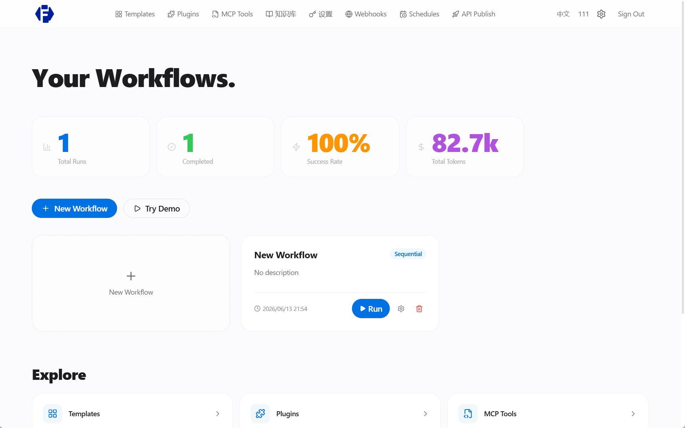
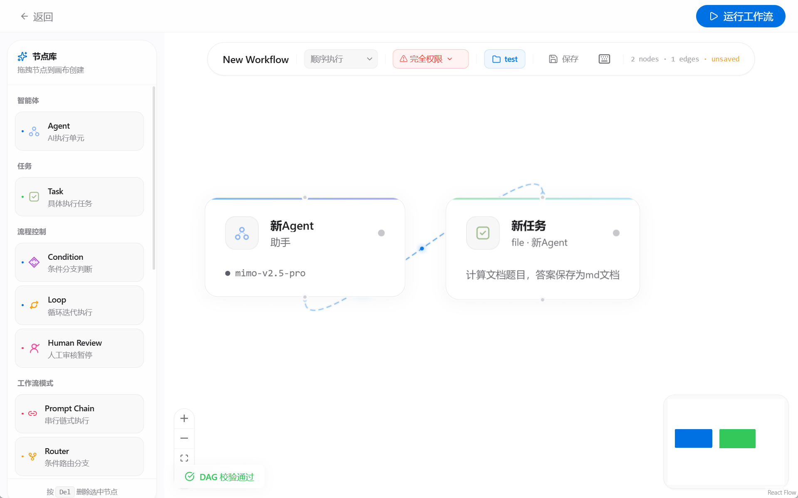

# Fugue

[](https://github.com/kari-kari1/Fugue/actions/workflows/ci.yml)
[](https://github.com/kari-kari1/Fugue/releases)
[](LICENSE)

**多智能体协作工作流编排平台。** 在可视化 DAG 画布上设计 Agent 和 Task，通过强大的编排引擎执行，并实时观察每一次思考和工具调用。

[English](README.md)

<p align="center">
  
</p>

<p align="center">
  
</p>

<p align="center">
  
</p>

---

## 特性

**编排能力**
- 可视化 DAG 编辑器，支持 13 种节点类型 -- Agent、Task、Condition、Loop、Human Review、5 种工作流模式、3 种事件流节点
- 4 种执行模式：顺序、并行、编排者-工人、事件驱动
- 迭代优化 -- 提交反馈后在完整上下文链基础上重新生成输出

**智能能力**
- 多 LLM 供应商支持（OpenAI、Anthropic、Google、Ollama、自定义端点）
- 知识库 -- 文档上传、分块、语义向量检索
- Agent 长期记忆 -- 三维复合评分（时效性 + 语义相关性 + 重要性）

**可观测性**
- WebSocket 实时推送 Agent 思考过程、工具调用、Token 用量和费用
- 执行追踪 -- 逐任务时间线和检查点快照

**平台能力**
- MCP Server（JSON-RPC + SSE）将 Agent 暴露为可调用工具
- 插件市场 -- 运行时安装/卸载
- Webhook 通知 -- HMAC-SHA256 签名
- 定时任务 -- 基于 Cron 表达式调度
- REST API 发布 -- 供外部系统集成

**安全能力**
- 三级审批模式：安全模式、半自动、全自动
- 执行沙箱 -- 文件系统和网络隔离（bubblewrap / Docker）
- Git Worktree 隔离 -- 并发执行互不干扰
- JWT 认证 + RBAC 权限（管理员/普通用户）
- 安全头中间件、请求限流

**桌面应用**
- Tauri（Rust）桌面端，原生文件系统访问
- 内置后端 Sidecar -- 无需单独部署服务
- Windows 安装包见 [Releases](https://github.com/kari-kari1/Fugue/releases)

## 快速开始

### 桌面应用（推荐）

从 [Releases](https://github.com/kari-kari1/Fugue/releases) 下载 `Fugue_0.1.0_x64-setup.exe`，安装即可使用。

### Docker Compose

```bash
cp .env.example .env
docker compose up -d --build
docker compose exec backend alembic upgrade head
```

前端：`http://localhost:3000` | API：`http://localhost:8000` | 文档：`http://localhost:8000/docs`

### 本地开发

```bash
# 后端
cd backend
python -m venv venv && source venv/bin/activate
pip install -r requirements.txt
cp .env.example .env
alembic upgrade head
uvicorn app.main:app --reload --port 8000

# 前端（新终端）
cd frontend
npm install
npm run dev

# 桌面开发模式
npm run tauri dev
```

## 架构

```
                    ┌─────────────────────────┐
                    │    React + ReactFlow     │
                    │      可视化 DAG 编辑器    │
                    └────────┬────────────────┘
                             │
              ┌──────────────┼──────────────┐
              │              │              │
         REST API      WebSocket       Tauri IPC
         (FastAPI)     (实时推送)     (本地文件)
              │              │              │
              └──────────────┼──────────────┘
                             │
                    ┌────────┴────────────────┐
                    │       执行引擎           │
                    │  ┌───────────────────┐  │
                    │  │ 顺序执行          │  │
                    │  │ 并行执行          │  │
                    │  │ 编排者-工人       │  │
                    │  │ 事件驱动          │  │
                    │  └───────────────────┘  │
                    │                          │
                    │  LLM ─── 工具 ─── RAG    │
                    │  记忆 ── 沙箱 ── Git     │
                    └──────────────────────────┘
```

## 技术栈

| 层 | 技术 |
|----|------|
| 前端 | React 19、TypeScript 5、Vite 6、ReactFlow 12、Zustand 5、Tailwind CSS 4 |
| 后端 | Python 3.12+、FastAPI、SQLAlchemy 2.0、Alembic、LiteLLM |
| 桌面 | Tauri 2（Rust）、WebView2 |
| 数据 | SQLite（桌面）/ PostgreSQL（服务器）、ChromaDB（向量） |
| 可选 | Redis、Celery、MinIO |

## 项目结构

```
Fugue/
├── backend/
│   ├── app/
│   │   ├── api/v1/          146 个 REST 端点
│   │   ├── engine/          执行引擎、Flow 编排器、沙箱
│   │   ├── models/          21 个 SQLAlchemy 模型
│   │   ├── services/        记忆、向量存储、Webhook、模板
│   │   ├── mcp_server/      MCP Server（JSON-RPC + SSE）
│   │   └── plugins/         插件 SDK 和内置插件
│   ├── tests/               299 个测试用例
│   ├── alembic/             数据库迁移
│   └── fugue.spec           PyInstaller 打包配置
├── frontend/
│   ├── src/
│   │   ├── pages/           14 个页面
│   │   ├── components/      ReactFlow 节点、编辑器面板
│   │   ├── stores/          Zustand 状态管理
│   │   └── api/             API 客户端层
│   ├── src-tauri/           Tauri 桌面端（Rust）
│   └── e2e/                 Playwright E2E 测试
├── docs/                    设计规范、部署指南
├── scripts/                 安全审计脚本
└── docker-compose.yml
```

## 测试

```bash
cd backend && pytest tests/ -v          # 299 个测试
cd frontend && npx tsc --noEmit         # 类型检查
cd frontend && npm run build            # 生产构建
```

## 参与贡献

1. Fork 本仓库
2. 创建特性分支
3. 提交更改
4. 推送并创建 Pull Request

详见 [CONTRIBUTING.md](CONTRIBUTING.md)。

## 许可证

[MIT](LICENSE)
